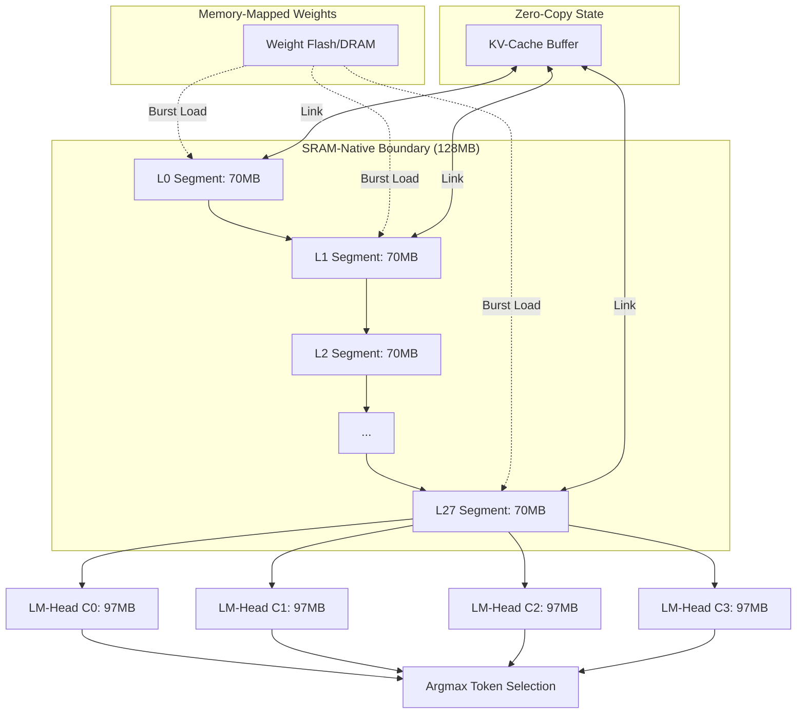

# Strategy 36: SRAM-Native 4B Residency Map

This map illustrates the memory layout of the Qwen-4B (Qwen2.5-3B) model optimized for **100% Neural Engine Residency** on M5 hardware.

## Architecture

| Component | Working Set (Weights) | Working Set (KV-Cache) | Total SRAM Req | Residency Plan |
| :--- | :--- | :--- | :--- | :--- |
| **Embeddings** | 389 MB | N/A | 389 MB | Disk-Paged (1-time) |
| **Transformer (L0)** | 60 MB | 10 MB | 70 MB | **SRAM-Native** (<128MB) |
| **Transformer (L1)** | 60 MB | 10 MB | 70 MB | **SRAM-Native** (<128MB) |
| ... | ... | ... | ... | ... |
| **Transformer (L27)** | 60 MB | 10 MB | 70 MB | **SRAM-Native** (<128MB) |
| **LM-Head (C0)** | 97 MB | N/A | 97 MB | **SRAM-Native** (<128MB) |
| **LM-Head (C1)** | 97 MB | N/A | 97 MB | **SRAM-Native** (<128MB) |
| **LM-Head (C2)** | 97 MB | N/A | 97 MB | **SRAM-Native** (<128MB) |
| **LM-Head (C3)** | 97 MB | N/A | 97 MB | **SRAM-Native** (<128MB) |

---

## Data Flow Diagram

## Performance Targets
* **Residency**: 100% (No DRAM Weight Streaming during dispatch)
* **Energy**: ~3.5W (Full NPU)
* **Target TPS**: 10-15 (M5 High-Efficiency Architecture)

